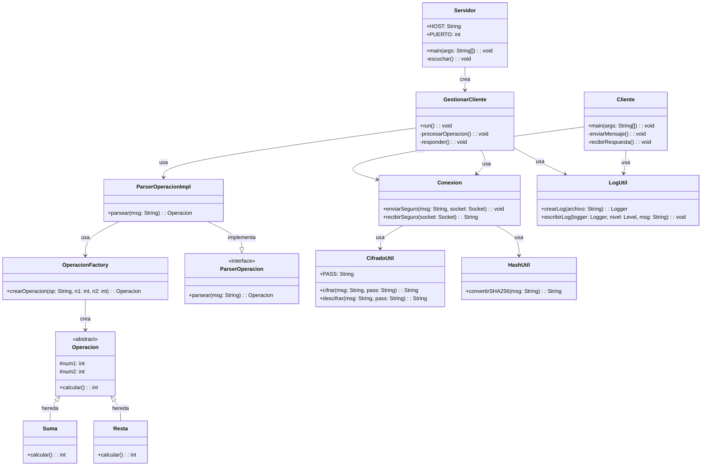

# Calculadora TCP (Comunicación Segura)

## Índice

- [Calculadora TCP (Comunicación Segura)](#calculadora-tcp-comunicación-segura)
  - [Índice](#índice)
  - [Descripción](#descripción)
  - [Características](#características)
  - [Requisitos](#requisitos)
  - [Arquitectura](#arquitectura)
  - [Uso](#uso)
    - [Opción 1: Ejecución Manual](#opción-1-ejecución-manual)
      - [Terminal 1 - Iniciar Servidor](#terminal-1---iniciar-servidor)
      - [Terminal 2 - Ejecutar Cliente](#terminal-2---ejecutar-cliente)
    - [Opción 2: Script Batch (Windows)](#opción-2-script-batch-windows)
  - [Seguridad](#seguridad)
    - [Capa 1: Cifrado simétrico](#capa-1-cifrado-simétrico)
    - [Capa 2: Verificación de integridad](#capa-2-verificación-de-integridad)
    - [Flujo de seguridad](#flujo-de-seguridad)
  - [Manejo de errores](#manejo-de-errores)
    - [Excepciones personalizadas](#excepciones-personalizadas)
  - [Notas de desarrollo](#notas-de-desarrollo)
    - [Características técnicas](#características-técnicas)
    - [Flujo de datos](#flujo-de-datos)

---

## Descripción

Aplicación de calculadora distribuida basada en una arquitectura **cliente-servidor** mediante sockets TCP, con un diseño orientado a la seguridad, la integridad de los mensajes y el manejo concurrente de múltiples clientes.

El sistema permite:

- Procesar solicitudes de cálculo desde distintos clientes.
- Proteger la confidencialidad de los datos en tránsito.
- Verificar la integridad de los mensajes intercambiados.
- Gestionar múltiples conexiones simultáneas.
- Registrar eventos y errores de forma auditable.

---

## Características

| Característica | Descripción |
| --- | --- |
| Arquitectura cliente-servidor | Comunicación bidireccional mediante sockets TCP |
| Operaciones matemáticas | Suma (+) y resta (-) con enteros |
| Cifrado simétrico | Protección de la confidencialidad del mensaje |
| Verificación de integridad | Comprobación de modificación de datos |
| Multihilo | El servidor atiende múltiples clientes simultáneamente |
| Logging | Registro de eventos en ficheros `.log` |
| Factory Pattern | Creación flexible de operaciones |
| Excepciones personalizadas | Control granular de errores |
| Diseño modular | Separación clara de responsabilidades |

---

## Requisitos

```text
Java 17+
Maven 3.6+
Lombok 1.18.38
```

---

## Arquitectura



---

## Uso

### Opción 1: Ejecución Manual

#### Terminal 1 - Iniciar Servidor

```bash
java -cp target/classes es.etg.dam.server.Servidor
```

#### Terminal 2 - Ejecutar Cliente

```bash
# Formato:
# java -cp target/classes es.etg.dam.client.Cliente <número1> <operador> <número2>

# Ejemplo: suma
java -cp target/classes es.etg.dam.client.Cliente 10 + 5
# Resultado: 15

# Ejemplo: resta
java -cp target/classes es.etg.dam.client.Cliente 20 - 8
# Resultado: 12
```

### Opción 2: Script Batch (Windows)

```bash
Ejecutar.bat
```

---

## Seguridad

### Capa 1: Cifrado simétrico

| Propiedad | Valor |
| --- | --- |
| Algoritmo | AES |
| Tamaño de clave | 128 bits |
| Codificación | UTF-8 |
| Función | Proteger la confidencialidad del mensaje |

El cifrado se utiliza para evitar que terceros puedan leer el contenido de las peticiones y respuestas durante la comunicación.

### Capa 2: Verificación de integridad

| Propiedad | Valor |
| --- | --- |
| Algoritmo | SHA-256 |
| Salida | 256 bits (64 caracteres hex) |
| Función | Detectar alteraciones del mensaje |

El hash permite comprobar si el contenido recibido coincide con el contenido enviado. Si el valor calculado no coincide con el recibido, se considera que el mensaje fue modificado.

### Flujo de seguridad

1. El cliente construye el mensaje con la operación.
2. Calcula el hash del mensaje original.
3. Cifra el mensaje antes de enviarlo.
4. El servidor recibe el mensaje, lo descifra y recalcula el hash.
5. Si ambos hashes coinciden, procesa la operación.
6. El servidor devuelve la respuesta siguiendo el mismo esquema.

---

## Manejo de errores

### Excepciones personalizadas

| Excepción | Causa |
| --- | --- |
| `ClienteException` | Error general en cliente |
| `ServidorException` | Error general en servidor |
| `OperacionNoSoportadaException` | Operador no válido |
| `ParserOperacionException` | Formato de mensaje inválido |
| `HashNoCoincideException` | El hash no coincide |
| `GestionClienteException` | Error procesando un cliente en servidor |

---

## Notas de desarrollo

### Características técnicas

- Servidor multihilo para atender múltiples clientes.
- Separación de responsabilidades entre red, cálculo, cifrado y logging.
- Uso de factoría para instanciar operaciones.
- Tratamiento explícito de errores mediante excepciones personalizadas.
- Registro de eventos para facilitar depuración y auditoría.

### Flujo de datos

```text
Cliente                           Servidor
  │                                  │
  ├─► 1. Lee argumentos              │
  ├─► 2. Construye mensaje           │
  ├─► 3. Calcula hash                │
  ├─► 4. Cifra mensaje ───────────►  │
  │                                  ├─► 5. Recibe
  │                                  ├─► 6. Descifra
  │                                  ├─► 7. Verifica hash
  │                                  ├─► 8. Parsea operación
  │                                  ├─► 9. Ejecuta cálculo
  │                                  ├─► 10. Cifra respuesta
  │ ◄─────────────────────────────── ├─► 11. Envía respuesta
  ├─► 12. Descifra respuesta         │
  ├─► 13. Verifica integridad        │
  └─► 14. Muestra resultado          │
```
